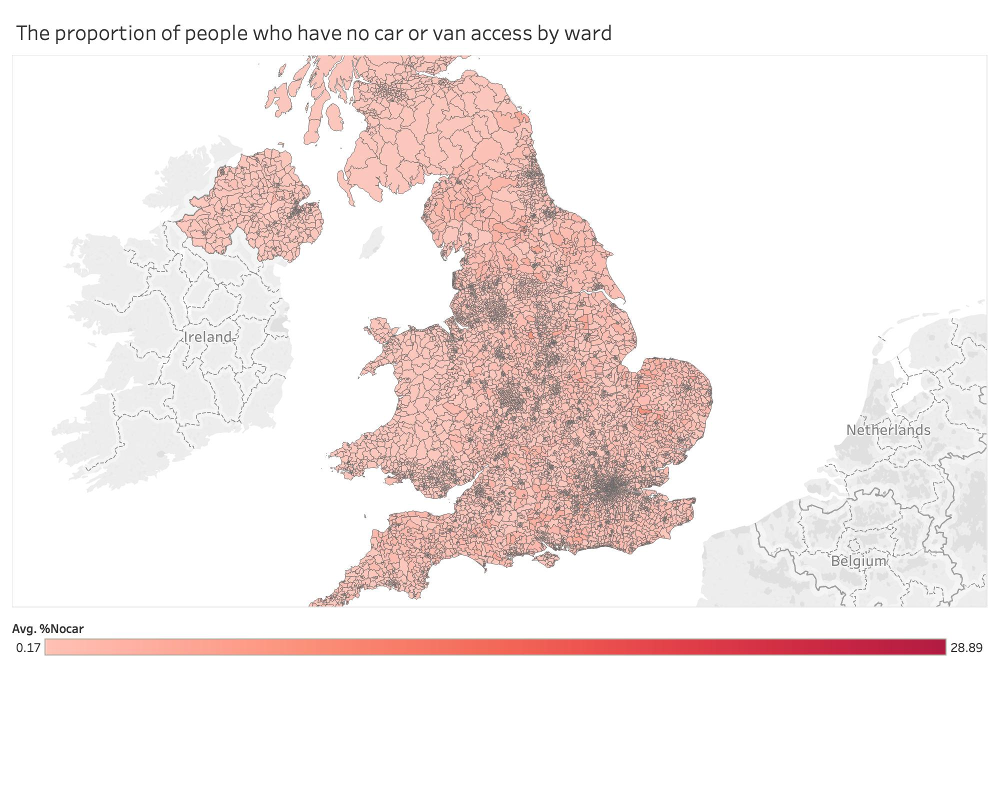
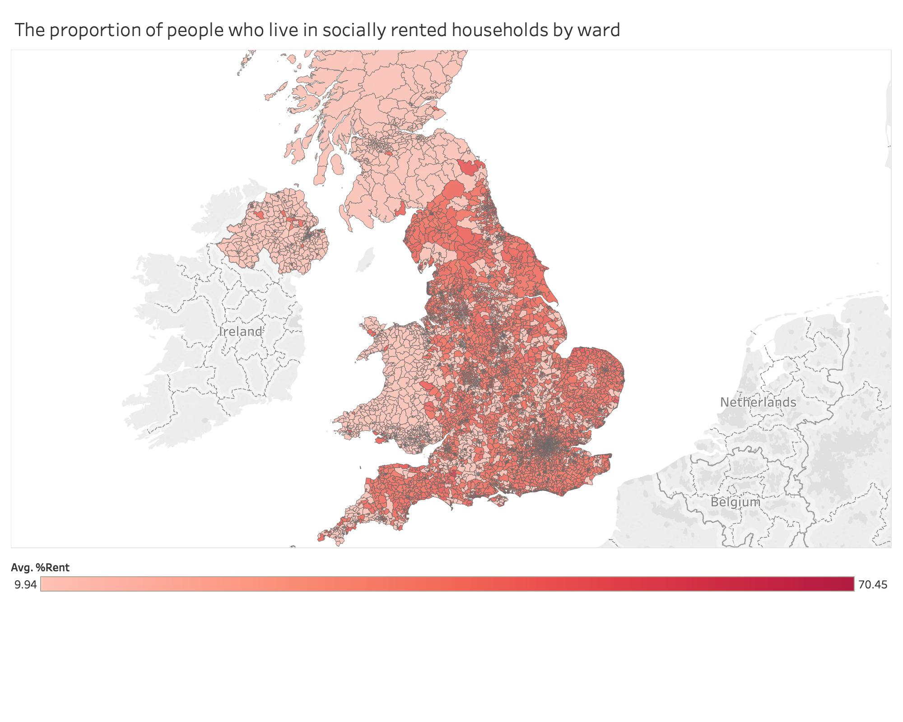

```{r setup, include=FALSE}
knitr::opts_chunk$set(echo = TRUE)
```

## **Mission: *AI and Data Economy* **
> ...use data, AI and innovation to transform the prevention, early diagnosis and treatment of chronic diseases by 2030.

**Stakeholder:** the public (as individual stakeholders), local government 

### Deprivation

In the UK a household is classed as deprived by the Office for National Statistics (2011) if it meets one or more of the following criteria: 

- **Employment**: Where any member of a household, who is not a full-time student, is either unemployed or long-term sick.

- **Education**: No person in the household has at least Level 2 education (see highest level of qualification), and no person aged 16 to 18 is a full-time student.

- **Health and disability**: Any person in the household has general health that is 'bad' or 'very bad' or has a long-term health problem.

- **Housing**: The household's accommodation is either overcrowded, with an occupancy rating -1 or less, or is in a shared dwelling, or has no central heating.

Studies show that children in the most deprived areas are nearly twice as likely to be obese when compared to those in the least deprived areas. Obesity and the associated health issues are estimated to have cost the NHS £4.2 billion in 2007 ([Baker, 2019](https://researchbriefings.files.parliament.uk/documents/SN03336/SN03336.pdf)).  This figure is expected to rise to reach a figure of £9.7 billion by 2050. This only encapsulates the cost the NHS and not the financial impact upon other services, such as social care and other economic consequences ([Baker, 2019](https://researchbriefings.files.parliament.uk/documents/SN03336/SN03336.pdf)).

### Why did we chose 10-11 year old as an indicator?

Children who are obese a that age are more likely to be obese as adults. ([WHO, 2019](https://www.who.int/dietphysicalactivity/childhood_consequences/en/))
By 2017, in the UK, approximately one third of children between the ages of 2 and 15  were overweight or obese ([Health and Social Care Information Centre, 2015](Health and Social Care Information Centre (2015) Health Survey for England 2014.)). Children are becoming obese at an increasingly young age and remaining obese for longer than previous generations ([Johnson et al, 2015](https://doi.org/10.1371/journal.pmed.1001828
)). They are more likely to suffer from poor levels of self-esteem and be subject to bullying, in addition to suffering from consequent diseases such as heart disease and type 2 diabetes ([Public Health England, 2018](https://www.gov.uk/government/news/record-high-levels-of-severe-obesity-found-in-year-6-children)). 

The reduction of obesity levels is crucial as obesity doubles the risk of premature death and in addition to the risk of physical diseases, individuals are likely to live with mental health conditions such as depression ([Gatineau and Dent, 2011](https://www.houstonisd.org/cms/lib2/TX01001591/Centricity/Domain/46686/Annotated_BibliographyStudentExample%20.pdf)). Access to parks and green spaces has been shown to reduce mortality as well as risk of various chronic diseases. 

Findings suggest that the proximity to a park may help promote population physical activity, when not hindered in access by major roadways, and has been linked to positive human health outcomes.  Especially in urban areas, open spaces are valued by theorists who relate them to the social, political, and physical health of residents and communities. Some argue that high-quality, pedestrian-friendly neighborhood spaces can engender beneficial interpersonal connections. However, in deprived areas, the  use of green spaces can be discouraged by either low accessibility or by anti-social behaviour which is off-putting parents from visiting parks with their children ([Edwards et al., 2014](https://journals.humankinetics.com/view/journals/jpah/11/5/article-p977.xml
); [Wolch et al., 2014](https://doi.org/10.1016/j.landurbplan.2014.01.017); [Timperio et al., 2005](https://www.nature.com/articles/0802865
)). 

To address the above issues, we therefore suggest a combined approach to evaluate the efficiency of local council’s intervention to tackle deprivation factors. For instance, in an urban context, practitioners have tended to address the issue of high rates of chronic diseases by implementing green areas that may have  been better used to promote outdoor activities, to result in a reduction of obesity especially in children. However, in our preliminary investigation, we did not find a sufficiently significant relation between the presence of urban green areas (mainly parks) or air pollution index and childhood obesity, most likely due to the aggregation of data by ward or region size. 


### Research Question
Using Child Obesity data (10-11 years) as representation of chronic disease, can we model which deprivation factors are prevalent per area in order to inform the government of areas of efficient investment, as well as the public on how to facilitate healthy lifestyle choices?

## Context

```{r message=FALSE, warning=FALSE}
library(plotly)
library(knitr)
library(tidyverse)
library(sf)
library(here)
library(fingertipsR)
library(tmap)
tmap_mode("view")
```


## Datasets
- [2011 Census](https://www.ons.gov.uk/census/2011census)
- [Public Health England local health data](http://www.localhealth.org.uk/#l=en;v=map15) (through *fingertipsR* package)

```{r cache = TRUE}
wards <- st_read(here("data", "raw", "Wards_December_2018_Generalised_Clipped_Boundaries_UK", "Wards_December_2018_Generalised_Clipped_Boundaries_UK.shp")) %>% 
  select(wd18cd, wd18nm, st_areasha) %>%
  st_transform(27700)

obese_year6_pct <- fingertips_data(IndicatorID = 93107, AreaTypeID = 8) %>%
  filter(AreaType == "Ward")


obese_year6_geo <- wards %>%
  right_join(obese_year6_pct, by = c("wd18cd" = "AreaCode")) %>%
  select(wd18cd, wd18nm, Value)

tm_shape(obese_year6_geo) + tm_polygons(col = "Value")
```

As this data is monitored on a continuous basis by the government and NHS, they would provide easy parameters for progress measures of potential new policies in promoting an active lifestyle based on where each region is deprived the most. 

## Analysis
We ran a regression model in order to investigate the relationship the dependent variable, which is obesity, and the independent variables which are the number of people with no qualification, the number of people with no access to a car or van, the number of households which a socially rented and the proportion of households which are classed as deprived.

```{r, echo=FALSE,  fig.align='center', out.width="70%"}

```

We have very promising results: 0.683 R-Squared meaning our model fitted 68%.

The R squared tell us the proportion of variance in the dependent variable, which is obesity, can be explained by the independent variables. This is an overall measure of the strength of association and does not relect the extent to which any particular independent variable is associated with the dependent variable.

The coefficient column tells us how independent variables are dependent on the selected variable %obese. We can see that:

Coefficient
  - socialrented: 0.5720
  - Deprivation_classification_of_household: 4.5348

The coefficient of the number of households which are socially rented is 0.57. The coefficient tells us the extent to which the independent variable, in this case the number of socially rented households, predicts the dependent variable which is obesity.
The coefficient of the number of households which are classed as deprived is 4.53.So as the coefficient is usually capped at a value of one this means that the model has overfit. Overfitting refers to a model which models the training fata too well, Therefore the models has learnt thr detail and noise in the training data to the extent that it negatively impact the perfomance of the model. Overfitting is a common problem in machine learning and data science. To avoid overfitting, we would ideally have more time to enable cross validation to be conducted, we could also train more data or utilise a technique known as bagging which employs a relatively unconstrained model to smooth out predictions.

```{r, echo=FALSE,  fig.align='center', out.width="70%"}




```

## Your recommendation

**General Recommendation:** Possible measures to be adopted, depending on the major contributing factor by region:

- The council should guarantee more affordable housing… why?
This will have a positive impact on all aspects of society. However, to reduce the risk of social segregation within the development, social housing should be incorporated into more affluent neighbourhoods, rather than be built apart from privately owned apartments. This would follow models utilised in Nordic countries, e.g. Finland, which integrate social rented with privately owned houses in order to combat social segregation.

- Education: neighbourhood program, promoting volunteering… why?
High fees in education relating to school meals or after-school activities results in the exclusion of vulnerable children. Therefore, neighbourhood programs run by volunteers could fill the gap between those who can and those cannot afford to partake otherwise.

- Increase services in healthcare and nutritional education… why?
The NHS should be more heavily involved in the implementation of programs that promote nutritional education (Healthy food access initiatives, nutrition classes, workshops, breakfast clubs, and educational materials to develop skills and reinforce knowledge about shopping and preparation of highly nutritious meals)

- If there is a park nearby but it is not used for outdoor activities, such measures should be implemented:
- Emission restrictions to reduce heavy traffic and high pollution in places where children play outdoors (schools, parks)
- Changes in land use that promote job-housing balance and use of public transit (and hence, reduce vehicle miles traveled)
- Promotion of zero emissions vehicles (maybe central government incentive?)
- Car-sharing programs
- Planning neighborhoods to reduce barriers to access to green spaces (i.e by building sidewalks)
...why?
This will guarantee accessibility of green spaces and, according to studies, contribute to the reduction of obesity rates.

 
*What are the caveats?*
   
Financial restrictions (public financial constraints)
Reliance on public ‘good will’ (human constraints)

**Data Recommendation:**

Encourage the publication of data regarding the financial investment of local authorities into local initiatives to promote an awareness and improved knowledge of nutrition. 

More congruence between datasets, for example the air pollution index data and the green space data. 

There is a wealth of backdating data for both input and output variables, making it incredibly easy to measure progress of any implemented policies. As all of the used data is collected publicly regardless of this investigation, this approach is simple to conduct.

**Ethics :** 

Ethical concerns linked to early profiling in children, potentially promoting eating disorders and bullying.


