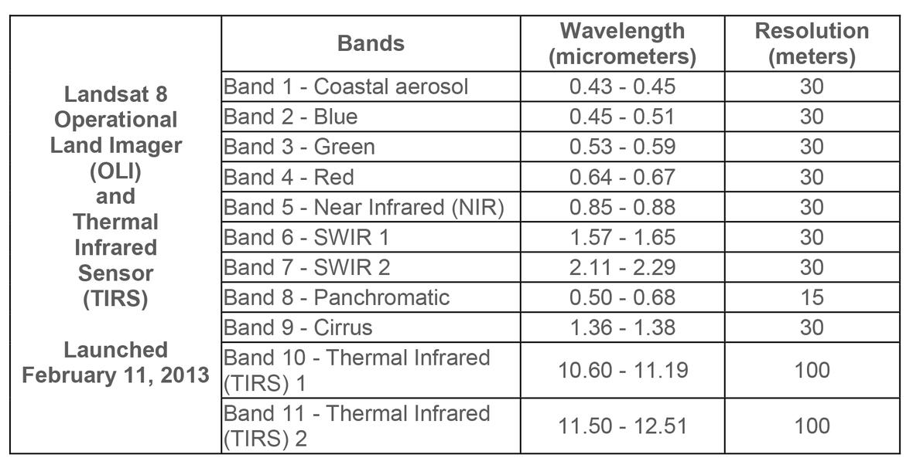
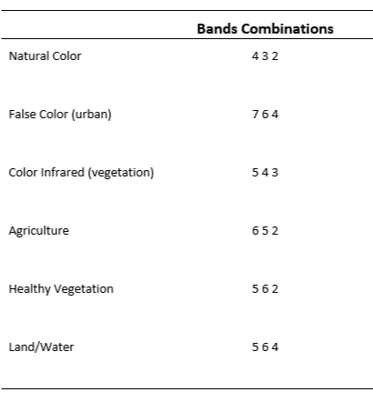
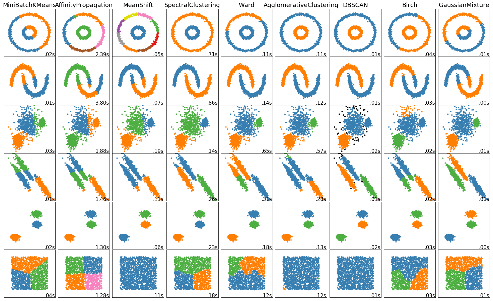
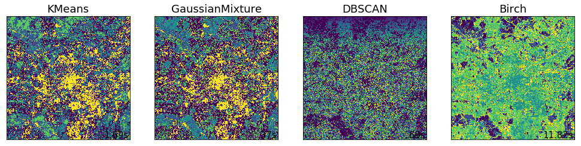

# Tutorial 1: Introduction to Raster Data and Analysis
## Learning Objectives
1. What is raster data?
2. Where to get raster data?
3. Basic information about your datasets
4. Mathematical applications to each dataset

## Learning Outcomes
1. Load and conduct appropriate pre-processing methods to begin raster analysis.
2. Identify how raster data is structured, and derive basic information from composites of raster layers.
3. Grasp the fundamental numerical approaches that can be applied to raster data for quick visualisation of specific properties.
4. Reproduce these methodologies to other datasets.

## Data
* The raster data that we will be using today is of the Manchester metropolitan area taken from the United States Geological Survey Landsat 8 OLI/TIR satellite.

* There are a total of 11 bands, saved in ```.TIFF``` format. Each sensor (band) captures different parts of the electromagnetic spectrum; and, what is captured heavily depends on what is reflected by the objects on the surface of the earth.

* The data is presented in a 30m by 30m resolution for most bands; except, in Band 8, which is called the panchromatic band represented in 15m by 15m cells; and, Band 10 and Band 11, which cover a larger scale of 100m x 100m.

* The table below gives the wavelengths and resolutions of the various bands that make up a Landsat 8 image. We will refer back to this table in the following exercises over the following tutorials.

``` {r echo=FALSE}

```

## Required libraries 
These are all the required libraries required for the next three remote-sensing tutorials.
```{r warning=FALSE, message=FALSE}
library(sp)
library(RColorBrewer)
library(lattice)
library(latticeExtra)
library(raster)
library(rgeos)
library(rgdal)
library(rasterVis)
library(ggplot2)
library(RStoolbox)
library(gridExtra)
library(fpc)
library(cluster)
library(dismo)
library(rpart)
library(randomcoloR)
library(randomForest)
library(plotly)
library(tidyverse)
library(htmlwidgets)
```

***

# Setup Environment

## Getting our data

There are several places that remote sensing data can be obtained. Depending on your coverage requirements, they may be available in various formats, resolutions, and sources.

For images in the USGS Landsat programme, my favourite repositories are:

* Landsat Look: https://landlook.usgs.gov/viewer.html
* Earth Explorer: https://earthexplorer.usgs.gov/
* GloVis: https://glovis.usgs.gov

You will need to create an account download the data should you wish to extend this tutorial to another area.

N.B. Bearing in mind the intended study area, these files can quickly become very large, and your workflow should be adapted to this.

For the purposes of this tutorial, the data we are going be used is available here: 

**https://drive.google.com/open?id=1NPUAqw1VJ6_jUNfp7srtmdMg4Oh10CWr**

Go ahead and download this folder and save this into your local machine

```{r error=TRUE}
# Let's now set up our environment on R
setwd("D:/Dropbox/PhD/Summer School/rs")

# Load the Manchester shapefile
manchester_shape <- readOGR('D:/Dropbox/PhD/Summer School/rs/manchester_boundary.shp')
plot(manchester_shape)

# Load our Landsat Data. We will be using Landsat 8's Band 1 to 8 in this practical.

manc_error <- paste0("LC08_L1TP_203023_20190513_20190521_01_T1_B", 1:8, ".tif")

# There is however an error with this dataset in that the panchromatic Band 8 does not fully align with the extent of the other raster layers. This prevents us from stacking all 8 bands into a single composite, as shown:

stack(manc_error)
```

# Preprocessing
## Extent rectification
The error with extents is quite common in RS analysis. There are several ways to go about to rectify this. One method is to sharpen all bands with Band 8. The other method is to resample Band 8 with the other bands used in our composite. 

Both ways take a little bit of time, but they are to ensure consistency throughout.

We may now want to think about the pros and cons of one method over the other in your own research.

The panchromatic sharpening can be used with the ```panSharpen()``` function in the ```RStoolbox``` library. 

In this tutorial, we are going to be using the ```resample``` method with the code below. 

```{r Resampling, error=TRUE}
# So now, let's fix this extent issue. 
# First, let's load the raster stack from just B1 to B7

manc_files <- paste0("LC08_L1TP_203023_20190513_20190521_01_T1_B", 1:7, ".tif")
manchester <- stack(manc_files)
plot(manchester)

# To resample, the following code should do the trick

# b8list <- list.files("C:/Users/mattk/OneDrive/Desktop/rs",pattern=".*LC08_L1TP_203023_20190513_20190521_01_T1_B[8]\\.tif$", ignore.case=TRUE, full.names=TRUE)

# b8 <- raster(b8list)

# ngb is the ```nearest neighbour``` method. This will take some time.

# b1 <- manchester$LC08_L1TP_203023_20190513_20190521_01_T1_B1

# b8 <- resample(b8, b1, method='ngb')

# Let's overwrite B8 with the new extent in our workspace.

# b8 <- writeRaster(b8, "LC08_L1TP_203023_20190513_20190521_01_T1_B8.tif", overwrite=TRUE)
```


Great! Let's re-stack of the raster layers back into one clean, single composite..

```{r}
manc_full <- manchester # typically, I would addLayer(Manchester, b8)

# Let's compare the extents now..

# compareRaster(manc_full$LC08_L1TP_203023_20190513_20190521_01_T1_B1,manc_full$LC08_L1TP_203023_20190513_20190521_01_T1_B8)
```

## Clipping

We are now going to clip the raster to the Manchester metropolitan area. The current raster covers a very large area, extending all the way down to the midlands. As such, it is a very large file to work with and may not be necessary given your intended research. For the purposes of this tutorial, we only want the Manchester metropolitan area. To get this area, we are going to clip and mask the ```manc_full``` raster with the ```manchester_shape``` layer.

``` {r}
# We first set the extent of Manchester with our shapefile.

e <- extent(manchester_shape)
manc_clip <- crop(manc_full,e)
manc_mask <- mask(manc_clip, manchester_shape)

# Let's name the bands now..

names(manc_mask) <- c('ultra-blue', 'blue', 'green', 'red', 'NIR', 'SWIR1', 'SWIR2')
```

# Examining Our Data

## Metadata

```{r}
# We can plot the various bands
plot(manc_mask)

# Here are some other codes to look at various aspects of the composite's metadata
crs(manc_mask) # projection
extent(manc_mask) # extent
ncell(manc_mask) # number of cells
dim(manc_mask) # number of rows, columns, layers
nlayers(manc_mask) # number of layers
res(manc_mask) # xres, yres
```

## Statistical relationships
``` {r}
# The above data however don't tell use about what is being captured within each band. For that, we can look at their histograms.
hist(manc_mask, 
     xlab = "spectral response", 
     breaks = 30)
# We can look at how they relate to each other

pairs(manc_mask[[1:7]])
```

## Raster Visualisation
Let's now have actually visualise our data. By manipulating which bands to display, we can take advantage of the resulting colours to highlight certain aspects of our raster.

Let's set out the code for the a ***True Colour Composite*** which is what we naturally see with our eyes. Other published combinations can be seen in the following table:

```{r}

```

### Simple True Colour Composite
```{r}
# With ggplot

ggRGB(manc_mask, r=4, g=3, b=2, stretch = "lin")+
  ggtitle("Natural Colour\n (R= Red, G= Green, B= Blue)") +
  xlab("long") +
  ylab("lat") + theme_light()

# Using the combinations above you could try to show several other band combinations on your own time

ggRGB(manc_mask, r=5, g=4, b=3, stretch = "lin")+
  ggtitle("False Colour") +
  xlab("long") +
  ylab("lat") + theme_light()

ggRGB(manc_mask, r=5, g=6, b=7, stretch = "lin")+
  ggtitle("Bands 5,6 and 7") +
  xlab("long") +
  ylab("lat") + theme_light()
```

## Raster visualisation with Mathematics
### Normalised Difference Indices
Up to now, we've just been looking at raster the rasters at quite a superficial level of detail. Going back to the first table, we already know that different bands represent different parts wavelengths captured by the electromagnetic spectrum. 

Therefore, if we know that that vegetation typically absorb within the Red band, but reflect within the Near-Infrared bands, we can begin to think of ways to extract vegetation from the image using raster formulas:

$$ Veg = \frac{NIR-Red}{NIR+Red}$$
Here is a general function to do this calculation
```{r}
nd <- function(img, a, b) {
  ba <- img[[a]]
  bb <- img[[b]]
  i <- (ba - bb) / (ba + bb)
  return(i)
}

# Let's plug in the numbers for the Vegetation.

ndvi <- nd(manc_mask, 5, 4)

# Let's look at the plot
plot(ndvi, col = rev(terrain.colors(10)), main = "Manchester-NDVI")

# Let's look at the histogram for this dataset
hist(ndvi, breaks = 40, main = "NDVI Histogram", xlim = c(-.3,.8))

## We can reclassify to the raster to show use what is most likely going to vegetation based on the histogram

## Typically you can cbind up to the 3rd quartile as a rule of thumb

veg <- reclassify(ndvi, cbind(-Inf, 0.3, NA))
plot(veg, main = 'Possible Veg cover')

## Let's look at this in relation to Manchester as a whole

plotRGB(manc_mask, axes = TRUE, stretch = "lin", main = "Landsat True Color Composite")
plot(veg, add=TRUE, legend=FALSE)
```

# Great Job!
As an extension, we can try these same calculations for various other elements in our raster. For example, the formulae for the built environment or water bodies can be expressed below. You can take these as extension task in your own free time.

$$ built = \frac{SWIR1 - NIR}{SWIR1 + NIR} $$
$$ water = \frac{Green - SWIR1}{Green + SWIR1} $$

These masks are the simplest way of attaining quick visualisations of your raster dataset. 

In the next tutorial, Maxim will take this idea to the next level to seperate not just vegetation from the Manchester scene, but also to identify different species of plants within these scenes.

This idea can be extended to built-environment if we know what surface materials are being used. For example, in zinc sheets are used in roofs in many informal settlements in Asia, we can then calculate growth of these informal settlements using the right mathematical equation. **HINTS FOR CLEAN GROWTH THURST**


# Tutorial 2: Raster Classification - Dr. Maxim Chernetskiy

## Learning Objective (5 minutes)
1. What is classification?
2. What types of classification are exist?
3. Two types of unsupervised classification
4. Supervised classification and evaluastion of the results

Classification in remote sensing is the process of arranging pixels into group of classes. Classification can be unsupervised (clustering) or supervised.


## Unsupervised classification (clustering) (10 min)

Unsupervised classification means what we don't know ""truth" about an image but we can group pixels into classes according to their spectral properties. There are many unsupervised methods which have their advantages for different types of data. In the figure below you can see example of application of some of these methods to synthetic datasets (https://scikit-learn.org/stable/modules/clustering.html).


```{r echo=FALSE}

```
We can see that different methods work differently depending on patterns. The interesting case in the last row which shows homogenious distribution. Only three of nine methods group all pixels into one class.

We can apply some of these methods to our landsat 8 Manchester scene.

```{r}

```

We see that KMeans and GaussianMixture give noisy but resonable results (compare to RGB) and DBSCAN producing most noisy results. Method Birch looks less noisy and gives distinct spatial patterns. However, the last method takes longest time to run. This method isn't available in R and we will not use it.

## K-Means classification
K-means is one of most popuar unsupervised classification methods (Tou and Gonzalez, 1974; Fränti and Sieranoja, 2019). We can see to the method through the cost function which looks like:

$J=\sum\limits_{i=1}^n \min\limits_{j \in \{i..k\}}||x_i-c_j||^2$

This means that we adjust n pixels into k classes by minimization of the cost function J. $c_j$ where $j=1..k$ are centroids. Distance to centroids determines classes. Centroids firstly initialized randomly and then adjasting according to cost function J.

Let's give names to the Landsat bands
```{r}
# hist(tif_stack)
band_names <- c('ultra-blue', 'blue', 'green', 'red', 'NIR', 'SWIR1', 'SWIR2')
```

Open the Landsat image and crop it to the area of Manchester.
```{r}
# Create list of bands file paths
lst_names <- manc_error
lst_names <- lst_names[c(1,2,3,4,5,6,7)]
b_stack0 <- stack(lst_names)
lst_names
```

```{r}
band_stack <- crop(b_stack0, extent(b_stack0, 2314, 2814, 3047, 3547))

names(band_stack) <- band_names

#plot all bands
plot(band_stack, legend = FALSE, main=band_names, col=grey(1:100/100))
```


Refering back to the first practical, et's see RGB image made by different combination of spectral bands. This will help us to interprete results of classification.

```{r}
plotRGB(band_stack, 4,3,2, stretch = 'lin', colNA='white', main='True Color')
plotRGB(band_stack, 5,4,3, stretch = 'lin', colNA='white', main='False Color')
plotRGB(band_stack, 5,6,7, stretch = 'lin', colNA='white', main='Bands 5,6 and 7')
```
We can see that vegetation is easier to recognize on the false color composite when Near Infrared (NIR) band is placed into red chanel. Healthy vegetation absorbes radiation in the Red range and strongly reflects in NIR. RGB combination of infra red bands shows vegetation as orange becouse Short Wave Infrared (SWIR) bands related to leaf water content. The difference with false color is that we can regonize not just vegetation but also different types of vegetation according to its water content.


Convert stack of 2D matrices to an array of vectors becouse classification code doesn't work with 2D arrays.

Let's see RGB image made by different combination of spectral bands. This will help us to interprete results of classification.

Convert stack of 2D matrices to an array of vectors becouse classification code doesn't work with 2D arrays.
```{r}
b_vec <- getValues(band_stack)
```

Look at the dimentionality of that vector.
```{r}
str(b_vec)
```

Set seed
```{r}
set.seed(99)
```

Do the classification!
```{r}
# Here we ommiting not a number values by na.omiy, set up number of centroids toten, maximum number of iteration to 500.
kmncluster <- kmeans(na.omit(b_vec), centers = 10, iter.max = 500, nstart = 5, algorithm="Lloyd")
```

Look at the return value (str)
```{r}
str(kmncluster)
```

Convert returned vector to 2D raster. Operator $ takes record "cluster" from returned list (look at previous chunk). 
```{r}
knr <- setValues(band_stack[[1]], kmncluster$cluster)
```

Set up colors for classes
```{r}
mycolor <- c("#fef65b","#ff0000", "#daa520","#0000ff","#0000ff","#00ff00","#cbbeb5", "#c3ff5b", "#ff7373", "#00ff00", "#808080")
```

## CLARA classification
The CLARA (Clustering LARge Application) algorithm is based on the Partition Around Medoids (PAM) algorithm which is an implementation of K-medoids algorithm (Kaufman and Rousseeuw, 2005).

The task of the K-medoids algorithm is to minimize the cost function
$J=min\sum\limits_{i=1}^n\sum\limits_{j=1}^nd(i,j)z_{i,j}$

For the CLARA classifiction we use the same vector 'b_vec' as for the k-means classification

```{r}
cccluster <- clara(na.omit(b_vec), k=10)
clara_img = setValues(band_stack[[1]], cccluster$cluster)
```

### Plot the results
```{r}
# Plot the results of both clustering methods
plot(knr, main = 'K-means classification', col = mycolor )
plot(clara_img, main = 'Clara classification', col = mycolor)
```
We ca see that CLARA method has separated different types of vegetation meanwhile K-Means grouped them into one cluster. Also CLARA better seoarated urban area. At the same time K-Means separated water to different cluster

# Supervise classification (10 min)
Supervised clussification is one of the main tool in working with Remote Sensing data. There are a lot of different methods with their own advantages and disadvantages. In this exercise we will use Classification and Regression Trees (CART) (Lawrence, 2001) and Random Forest (Ho, 1998) methods.

## Classification and Regression Trees (CART)

Land Cover Map 2015 (LCM2015) will be used as reference data. LCM2015 is made using satellite data and cartographical information and provides land cover information for the UK.Spatial resolution 25m.
LCM2015 has following classes:

0       Unclassified,
1       Broadleaved Woodland,
2       Coniferous Woodland,
3       Arable and Horticulture,
4       Improved Grassland,
5       Neutral Grassland,
6       Calcareous Grassland,
7       Acid grassland,
8       Fen, Marsh and Swamp,
9       Heather,
10      Heather grassland,
11      Bog,
12      Inland Rock,
13      Saltwater,
14      Freshwater,
15      Supra-littoral Rock,
16      Supra-littoral Sediment,
17      Littoral Rock,
18      Littoral sediment,
19      Saltmarsh,
20      Urban,
21      Suburban.

Setup class names and colors
```{r}
# Get LCM data
lcm <- brick('lcm2015_landsat_stack.tif') 

# Crop LCM data using row and column numbers:
lcm <- crop(lcm, extent(lcm, 2314, 2814, 3047, 3547))


names(lcm) <- c("lcm2015", "prob")

# The class names
class_names <- c("Broadleaved Woodland", "Coniferous Woodland", "Arable and Horticulture", "Improved Grassland", "Neutral Grassland", "Calcareous Grassland", "Acid grassland", "Fen, Marsh and Swamp", "Heather", "Heather grassland", "Bog", "Inland Rock", "Saltwater", "Freshwater", "Supra-littoral Rock", "Supra-littoral Sediment", "Littoral Rock", "Littoral sediment", "Saltmarsh", "Urban", "Suburban")

lcmclass <- c()

u_val = unique(lcm[[1]])
i = 1
for (v in u_val){
  lcmclass <- append(lcmclass, class_names[v])
}


classdf <- data.frame(classvalue1 = c(0:8), classnames1 = lcmclass)

```

### Plot the LCM reference data

```{r}
# Print which LCM classes are exist in our area
unique(lcm[[1]])
plot(lcm)
```

Ratify (RAT = "Raster Attribute Table") the LCM2015. It defines RasterLayer as a categorical variable. Such a RasterLayer is linked to other values via a "Raster Attribute Table" (RAT).
```{r}
lcm_rat <- lcm[[1]]
lcm_rat <- ratify(lcm_rat)
rat <- levels(lcm_rat)[[1]]
rat$landcover <- lcmclass
levels(lcm_rat) <- rat
```

```{r}
# Set the random number generator to reproduce the results
set.seed(99)

# Sampling by loading the training sites locations
samp <- sampleStratified(lcm_rat, size = 100, na.rm = TRUE, sp = TRUE)
samp

table(samp$lcm_rat)
```

### Load the LCM color table
We use color scheme provided by LCM in lcm2015gb25m.tif-Band_1.clr file
```{r}
#cl = read.table('j:\\satellite\\RS_workshop\\LCM2015\\lcm-2015-25m_3034373\\lcm2015gb25m.tif-Band_1.clr', header = FALSE, sep = "", dec = ".")
#cl = read.table('LCM2015/lcm-2015-25m_3034373/lcm2015gb25m.tif-Band_1.clr', header = FALSE, sep = "", dec = ".")
cl = read.table('lcm2015gb25m.tif-Band_1.clr', header = FALSE, sep = "", dec = ".")

# make an empty vector
col_vector <- c()

# load normalized colors to col_vector
for (i in 2:dim(cl)[1]){
  col_vector <- append(col_vector, rgb(cl[i, 2]/255, cl[i, 3]/255, cl[i,4]/255))
}
```

### Show training sites distribution (white crosses)
```{r error=TRUE}
# detach('package:tidyr')
# detach('package:tidyverse')
# detach('package:plotly')
# detach('package:ggplot2')

plt <- levelplot(lcm_rat, col.regions = col_vector[u_val], main = 'Training Sites')
print(plt + layer(sp.points(samp, pch = 3, cex = 0.5, col = "white")))
```


### Extract values for sites
```{r error=TRUE}
# Extract the layer values for the locations
sampvals <- extract(band_stack, samp, df = TRUE)

# sampvals no longer has the spatial information. To keep the spatial information you use `sp=TRUE` argument in the `extract` function.
# drop the ID column
sampvals <- sampvals[, -1]

# combine the class information with extracted values
sampdata <- data.frame(classvalue = samp@data$lcm2015, sampvals)
```

### Show the CART classification tree
```{r error=TRUE}
# Train the model
cart <- rpart(as.factor(classvalue)~., data=sampdata, method = 'class', minsplit = 5)

# Plot the trained classification tree
plot(cart, uniform=TRUE, main="Classification Tree")
text(cart, cex = 0.8)
```
### Perfome Random Forest classification and show the output
```{r error=TRUE}
# Train the model
rforest <- randomForest(as.factor(classvalue)~., data=sampdata, method = 'class', minsplit = 5)

# Plot the trained classification tree
plot(rforest)
#text(rforest, cex = 0.8)
```

CART Predict the subset data based on the model
```{r error=TRUE}
pr <- predict(band_stack, cart, type='class')
pr <- ratify(pr)
```

Random Forest predict the subset data based on the model
```{r error=TRUE}
pr_forest <- predict(band_stack, rforest, type='class')
pr_forest <- ratify(pr_forest)
```


### CART: Take only class names which are exist in the classification results
```{r error=TRUE}
rat1 <- levels(pr)[[1]]
class11 <- c()

i = 1
for (v in rat1$ID){
  class11 <- append(class11, class_names[v])
}
class11
```

### Random Forest: Take only class names which are exist in the classification results (the same as above)
```{r error=TRUE}
rat1_forest <- levels(pr_forest)[[1]]
class11_forest <- c()

i = 1
for (v in rat1_forest$ID){
  class11_forest <- append(class11_forest, class_names[v])
}
class11_forest
```
Here we see that Random Forest has found more land cover classes than CART.


### Plot the results
```{r error=TRUE}
#CART
rat1$legend <- class11
levels(pr) <- rat1

levelplot(pr, maxpixels = 1e6,
col.regions = col_vector[rat1$ID],
scales=list(draw=FALSE),
main = "CART classification of Landsat 8")

#Random Forest
rat1_forest$legend <- class11_forest
levels(pr_forest) <- rat1_forest

levelplot(pr_forest, maxpixels = 1e6,
col.regions = col_vector[rat1_forest$ID],
scales=list(draw=FALSE),
main = "Random Forest classification of Landsat 8")

```
Here we can see that two classes which were found by Random Forest ('Calcareous Grassland' and 'Neutral Grassland') are very small and can be neglected. The class 'Arable and Horticulture' is located in the top left corner of the Training Sites image and it has been found by Random Forest around the same area. CART has claffified some urban ares as 'Inland Rock' whereas Random Forest correctly grouped these pixels as 'Urban'.

## Results evaluation

```{r error=TRUE}
sampdata11 <- sampdata[sampdata$classvalue==rat1$ID,]
set.seed(99)
j <- kfold(sampdata11, k = 5, by=sampdata11$classvalue)
table(j)
sampdata11[sampdata11$classvalue==6,]

```

```{r error=TRUE}
x <- list()
for (k in 1:5) {
  train <- sampdata11[j!= k, ]
  test <- sampdata11[j == k, ]
  cart <- rpart(as.factor(classvalue)~., data=train, method = 'class', minsplit = 5)
  pclass <- predict(cart, test, type='class')
  # create a data.frame using the reference and prediction
  x[[k]] <- cbind(test$classvalue, as.integer(pclass))
}
```

```{r error=TRUE}
y <- do.call(rbind, x)
y <- data.frame(y)
colnames(y) <- c('observed', 'predicted')

conmat <- table(y)

# change the name of the classes
colnames(conmat) <- class11
rownames(conmat) <- class11

conmat
```

### Compute the overall accuracy and the “Kappa” statistic.
#### Overall accuracy:

```{r error=TRUE}
# number of cases
n <- sum(conmat)
n
## [1] 1600
# number of correctly classified cases per class
diag <- diag(conmat)
# Overall Accuracy
OA <- sum(diag) / n
OA
```

#### Kappa:

```{r error=TRUE}
# observed (true) cases per class
rowsums <- apply(conmat, 1, sum)
p <- rowsums / n
# predicted cases per class
colsums <- apply(conmat, 2, sum)
q <- colsums / n
expAccuracy <- sum(p*q)
kappa <- (OA - expAccuracy) / (1 - expAccuracy)
kappa
```

#### Producer and user accuracy
```{r error=TRUE}
# Producer accuracy
PA <- diag / colsums
# User accuracy
UA <- diag / rowsums
outAcc <- data.frame(producerAccuracy = PA, userAccuracy = UA)
outAcc
```

## References
1. Fränti, P., Sieranoja, S. How much can k-means be improved by using better initialization and repeats? Pattern Recognition, Volume 93, September 2019, Pages 95-112
2. Kaufman, L., Rousseeuw, P. J. 2005. Finding Groups in Data: An Introduction to Cluster Analysis. John Wiley & Sons, Inc
3. Ho T.K. The Random Subspace Method for Constructing Decision Forests. 1998. IEEE Transactions on Pattern Analysis and Machine Intelligence. 20 (8): 832–844. 
4. Lawrence, R. L. Rule-based classification systems using classification and regression tree (CART) analysis. Photogrammetric Engineering & Remote Sensing. Vol. 67, No. 10, 2001, pp. 1137-1142.
5. Tou, J. T., Gonzalez, R. C. 1974. Pattern Recognition Principles, Addison-Wesley Publishing Company, Reading, Massachusetts.

# Tutorial 3: Application for Raster Analysis: Urban Heat Island Monitoring - Dr. Andrew MacLachlan

## Calculating tempeartures from Landsat data

Here we are going to compute temperature from Landsat data --- there are many methods that can be found within literature to do so but we will use the one originally developed by Artis & Carnahan (1982), recently summarised by Guha et al. 2018 and and Avdan and Jovanovska (2016).

Some of the terms used our outlined in the remote sensing background section at the end of the document, so check back there if you get confused.

Calculate the Top of Atmopshere (TOA) spectral radiance from the Digital Number (DN) using:

$$\lambda= Grescale * QCAL + Brescale$$

TOA spectral radiance is light reflected off the Earth as seen from the satellite measure in radiance units.

In this equation Grescale and Brescale represent the gain and bias of the image, with QCAL the Digital Number (DN) --- how the raw Landsat image is captured. 

Grescale and Brescale are available from the ```.MTL``` file provided when you downloaded the Landsat data. Either open this file in notepad and extract the required values for band 10 gain (MULT_BAND) and bias (ADD_BAND) 

...Or we can automate it using the ```MTL()``` function within the ```RStoolbox``` package.

```{r results="hide", warnings=FALSE, message=FALSE, cache=TRUE}
library(ggplot2)
library(plotly)

MTL <- list.files("D:/Dropbox/PhD/Summer School/rs",pattern="*.txt", ignore.case=TRUE, full.names = TRUE)
readMTL<-readMeta(MTL)
#To see all the attributes
readMTL
```

In this part of the practical, we are going to be using B10 of the Manchester scene.

```{r, cache=TRUE, error=TRUE}
e <- extent(manchester_shape)
manc_b10 <- raster("LC08_L1TP_203023_20190513_20190521_01_T1_B10.tif")

clip_b10 <- crop(manc_b10,e)
b10_mask <- mask(clip_b10, manchester_shape)

offsetandgain <- subset(readMTL$CALRAD, rownames(readMTL$CALRAD) == "B10_dn")
```

Run the calculation using the band 10 raster layer

```{r, cache=TRUE, error=TRUE}
TOA <-  offsetandgain$gain *
  b10_mask + 
  offsetandgain$offset

plot(TOA)
```

Next convert the TOA to Brightness Temperature $T_b$ using the following equation:

$$T_b=\frac{K_2}{ln((K_1/\lambda)+1)}$$

Brightness temperature is the radiance travelling upward from the top of the atmosphere to the satellite in units of the temperature of an equivalent black body.

K1 (774.8853) and K2 (1321.0789) are pre launch calibration constants provided by USGS.

See: https://prd-wret.s3-us-west-2.amazonaws.com/assets/palladium/production/atoms/files/LSDS-1574_L8_Data_Users_Handbook_v4.0.pdf

Instead of hardcoding these values...yep, you guessed it... we can extract them from our ```MTL```

```{r, cache=TRUE, error=TRUE}
Calidata <- as.data.frame(readMTL$CALBT)
# subet the rows
Calidata <- subset(Calidata, rownames(Calidata) %in% "B10_dn")
# subset the columns
K1<-subset(Calidata, select=(K1))
K2<-subset(Calidata, select=(K2))
# get just the values out
K1<-K1$K1
K2<-K2$K2
# this would also work for K1
K1<-readMTL$CALBT$K1[1]
#for K2
K2<-readMTL$CALBT$K2[1]
Brighttemp<-(K2 / log((K1 / TOA) + 1))
```

 
Earlier we calcualted NDVI, let's use that to determine emissivity of each pixel.

First we need to calculate the fractional vegetation of each pixel, through the equation:

$$F_v= \left( \frac{NDVI - NDVI_{min}}{NDVI_{max}-NDVI_{min}} \right)^2$$

```{r, cache=TRUE, error=TRUE}
facveg=(ndvi-0.2/0.5-0.2)^2
```

Fractional vegetation cover is the ratio of vertically projected area of vegetation to the total surface extent.

Here, $NDVI_{min}$ is the minimum NDVI value (0.2) where pixels are considered bare earth and $NDVI_{max}$ is the value at which pixels are considered healthy vegetation (0.5)

27. Now compute the emissivity using:

$$\varepsilon = 0.004*F_v+0.986$$

```{r, cache=TRUE}
emiss=0.004*facveg+0.986
```

Emissivity is the ratio absorbed radiation engery to total incoming radiation engery compared to a blackbody (which would absorb everything), being ameasure of absoptivity.

Great, we're nearly there... get our LST following the equation from Weng et al. 2004 (also summarised in Guja et al. (2018) and Avdan and Jovanovska (2016)):

$$LST= \frac{T_b}{1+(\lambda \varrho T_b / (p))ln\varepsilon}$$

Where:

$$p= h\frac{c}{\varrho}$$

Ok, don't freak out....let's start with calculating $p$

Here we have:

* $h$ which is Plank's constant $6.626 × 10^-34 Js$

* $c$ which is the velocity of light in a vaccum $2.998 × 10^8 m/sec$

* $\varrho$ which is the Boltzmann constant of $1.38 × 10^-23 J/K$

```{r, cache=TRUE, error=TRUE}
Boltzmann=1.38*10e-23
Plank=6.626*10e-34
c=2.998*10e8
p=Plank*(c/Boltzmann)
```

Now for the rest of the equation....we have the values for:

* $\lambda$ which is the effective wavelength of our data (10.9 for Landsat 8 band 10)

* $\varepsilon$ emissivity 

* $T_b$ Brightness Temperature

Run the equation with our data

```{r, cache=TRUE, error=TRUE}
#define remaining varaibles
lambda=1.09e-5
#run the LST calculation
LST <-Brighttemp/(1 +(lambda*Brighttemp/p)*log(emiss))
# check the values
LST
```

Are the values very high?... That's because we are in Kevlin not degrees Celcius...let's fix that and plot the map

```{r, cache=TRUE,error=TRUE}
LST<-LST-273.15
plot(LST)
```

Nice that's our temperature data sorted.

Calucating urban area from Landsat data

How about we extract some urban area using another index and then see how our temperature data is related?

We will use the Normalized Difference Built-up Index (NDBI) algorithm for identification of built up regions using the reflective bands: Red, Near-Infrared (NIR) and Mid-Infrared (MIR) originally proposed by Zha et al. (2003).

It is very similar to our earlier NDVI calculation but using different bands...

$$NDBI= \frac{SWIR1-NIR}{SWIR1+NIR}$$

In Landsat 8 data the SWIR is band 6 and the NIR band 5

31. Let's compute this index now...

```{r, cache=TRUE, error=TRUE}
NDBI <- nd(manc_mask, 6, 5)
```

But do you remember our function? ...Well this is the same calculation we used there just with different raster layers (or bands) so we could reuse it...

We could plot the varaibles agaisnt each other but there are a lot of data points

```{r, cache=TRUE,error=TRUE}
plot(values(NDBI), values(LST))
```

This is termed the overplotting problem. So, let's just take a random subset of the same pixels from both raster layers. 

To do so we need to again stack our layers

```{r, cache=TRUE, error=TRUE}
# stack the layers
computeddata=stack(LST,NDBI)
# take a random subset
random=sampleRandom(computeddata, 500, cells=TRUE)
# check the output
plot(random[,2], random[,3])
```

Transfrom the data to a data.frame to work with ggplot, then plot

```{r, cache=TRUE, error=TRUE}
#convert to a data frame
randomdf=as.data.frame(random)
#rename the coloumns
names(randomdf)<-c("cell", "Temperature", "Urban")
heat<-ggplot(randomdf, aes(x = Urban, y = Temperature))+
  geom_point(alpha=2, colour = "#51A0D5")+
  labs(x = "Temperature", 
       y = "Urban index",
       title = "Manchester urban and temperature relationship")+
   geom_smooth(method='lm', se=FALSE)+
  theme_classic()+
  theme(plot.title = element_text(hjust = 0.5))
# interactive plot
ggplotly(heat)
```

How about plotting the whole dataset rather than a random subset...

```{r message=FALSE, warning=FALSE, cache=TRUE, error=TRUE}
computeddatadf<-as.data.frame(computeddata)

names(computeddatadf)<-c("Temperature", "Urban")

hexbins <- ggplot(computeddatadf, aes(x=Urban, y=Temperature) ) +
  geom_hex(bins=100, na.rm=TRUE) +
  labs(fill = "Count per bin") +
  geom_smooth(method='lm', se=FALSE, size=0.6) +
  theme_bw()

ggplotly(hexbins)
```

To see if our varaibles are related let's run some basic correlation

```{r, cache=TRUE, error=TRUE}
stat.sig=cor.test(computeddatadf$Temperature, computeddatadf$Urban, use = "complete.obs",
    method = c("pearson"))
stat.sig
```


## References

Avdan, U. and Jovanovska, G., 2016. Algorithm for automated mapping of land surface temperature using LANDSAT 8 satellite data. Journal of Sensors, 2016.

Guha, S., Govil, H., Dey, A. and Gill, N., 2018. Analytical study of land surface temperature with NDVI and NDBI using Landsat 8 OLI and TIRS data in Florence and Naples city, Italy. European Journal of Remote Sensing, 51(1), pp.667-678.

Weng, Q., Lu, D. and Schubring, J., 2004. Estimation of land surface temperature–vegetation abundance relationship for urban heat island studies. Remote sensing of Environment, 89(4), pp.467-483.

Young, N.E., Anderson, R.S., Chignell, S.M., Vorster, A.G., Lawrence, R. and Evangelista, P.H., 2017. A survival guide to Landsat preprocessing. Ecology, 98(4), pp.920-932.

Zha, Y., Gao, J. and Ni, S., 2003. Use of normalized difference built-up index in automatically mapping urban areas from TM imagery. International journal of remote sensing, 24(3), pp.583-594.
