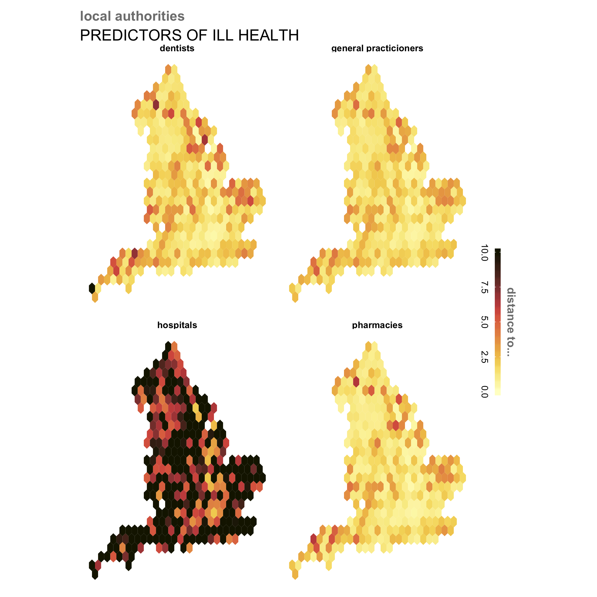
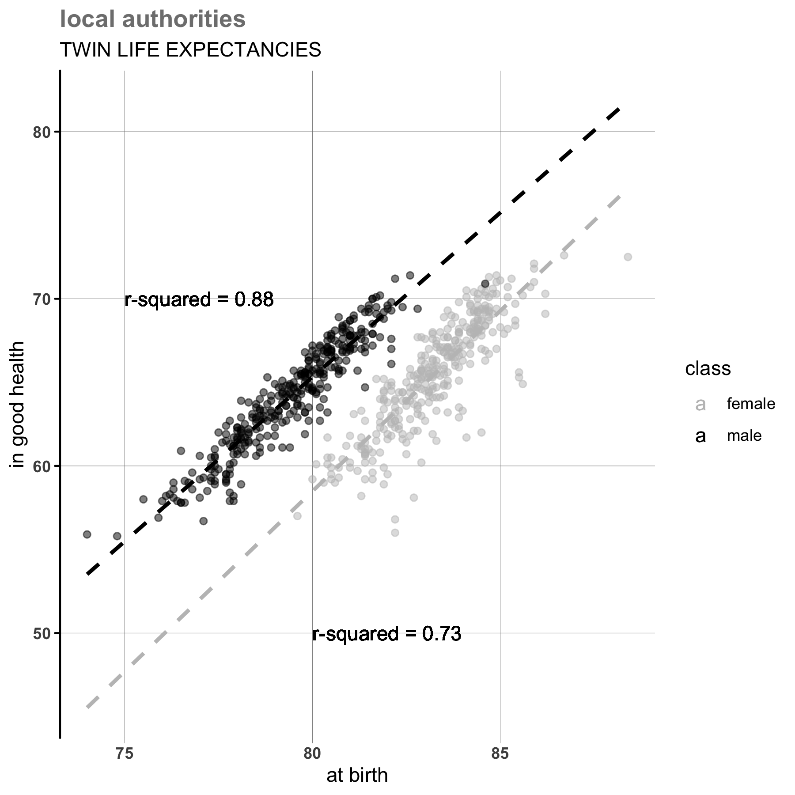
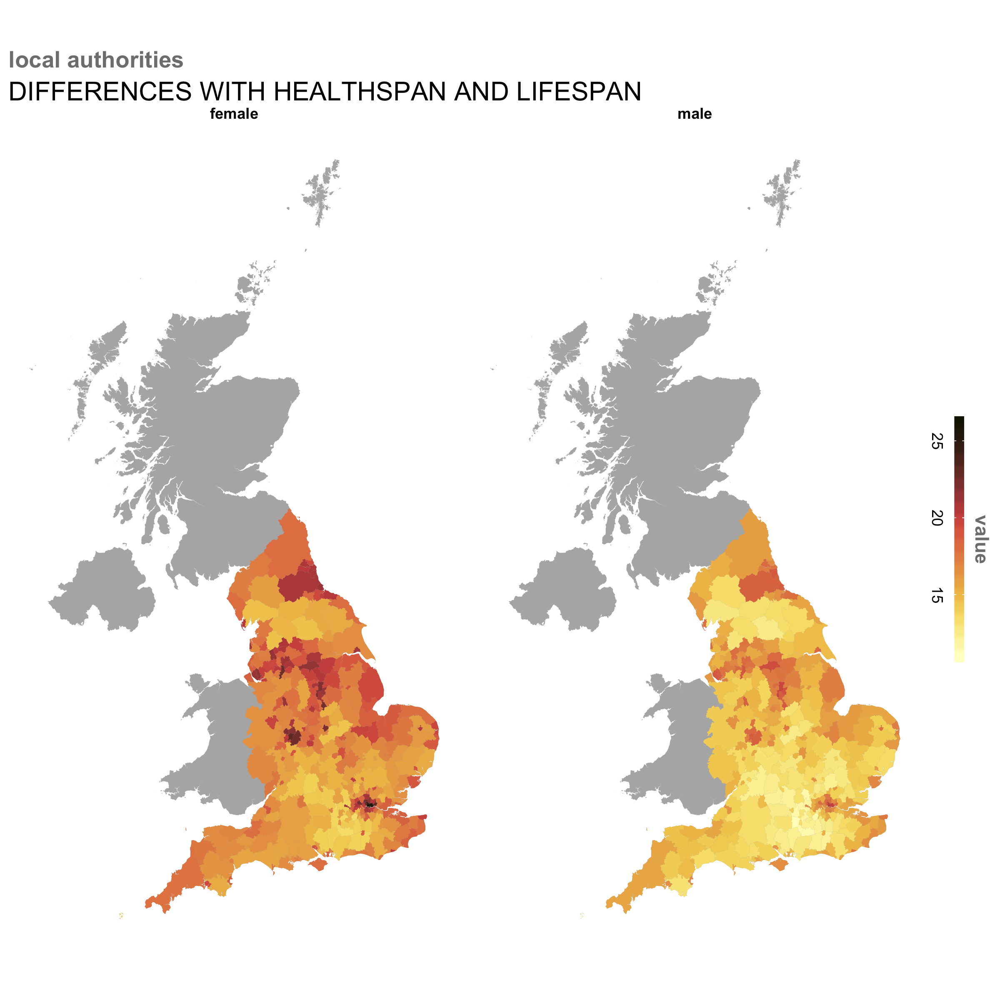
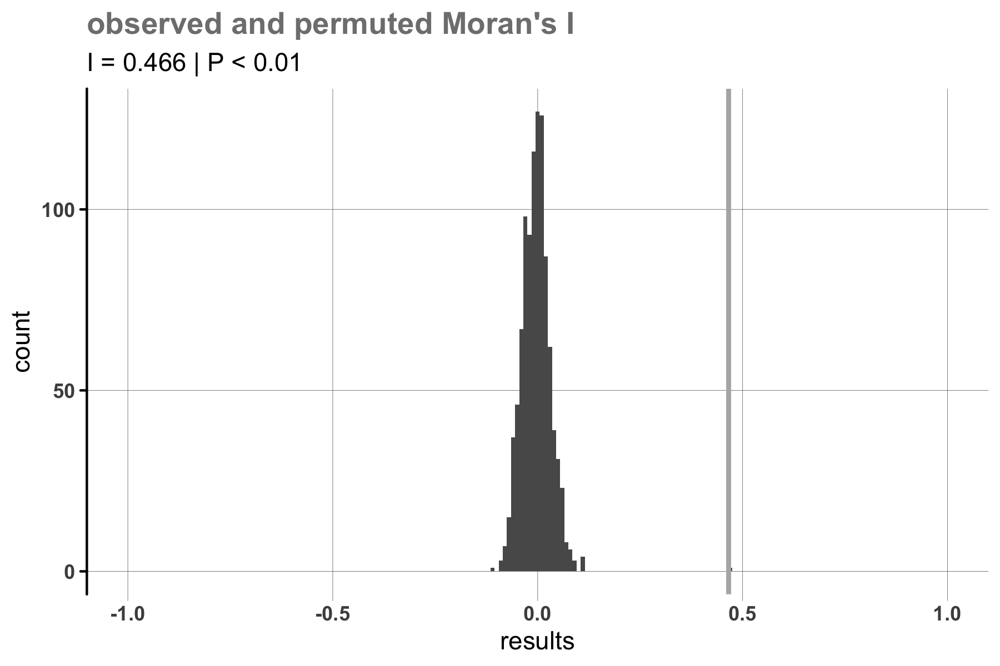
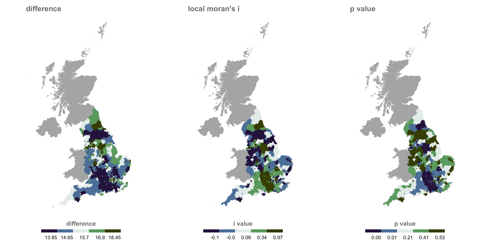
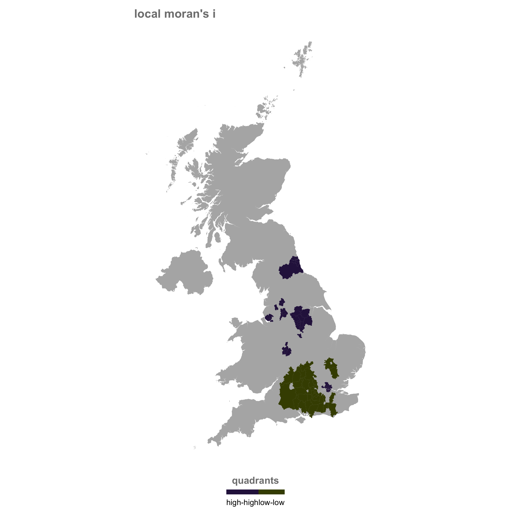
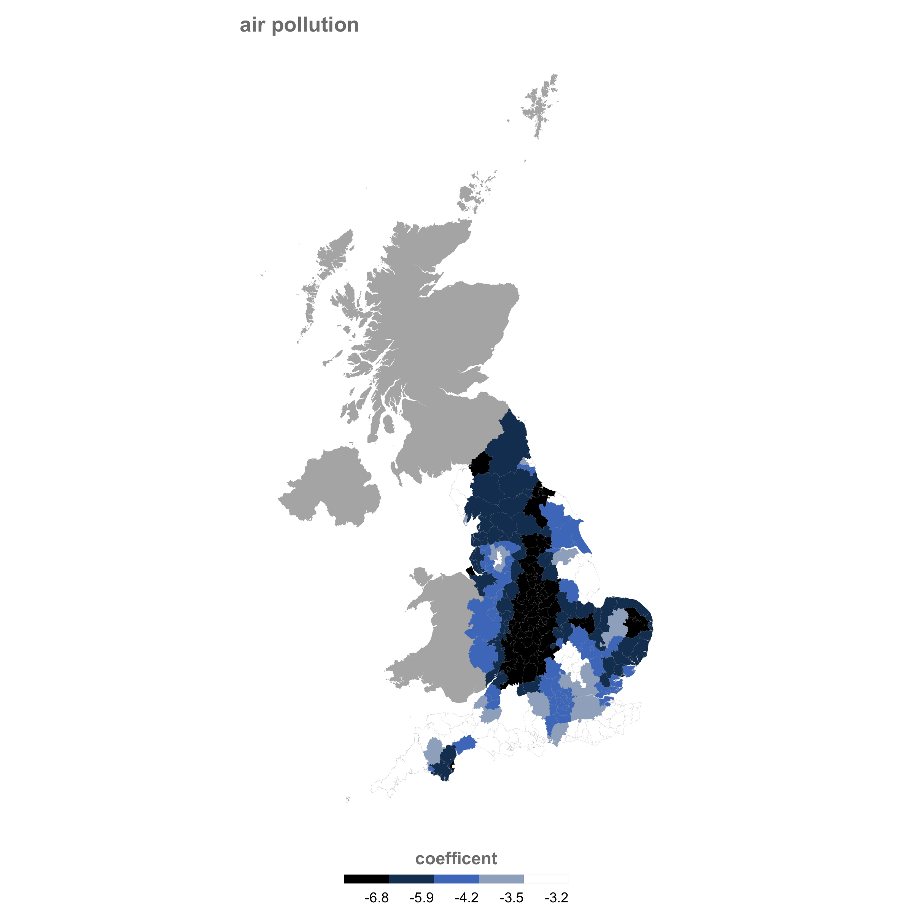
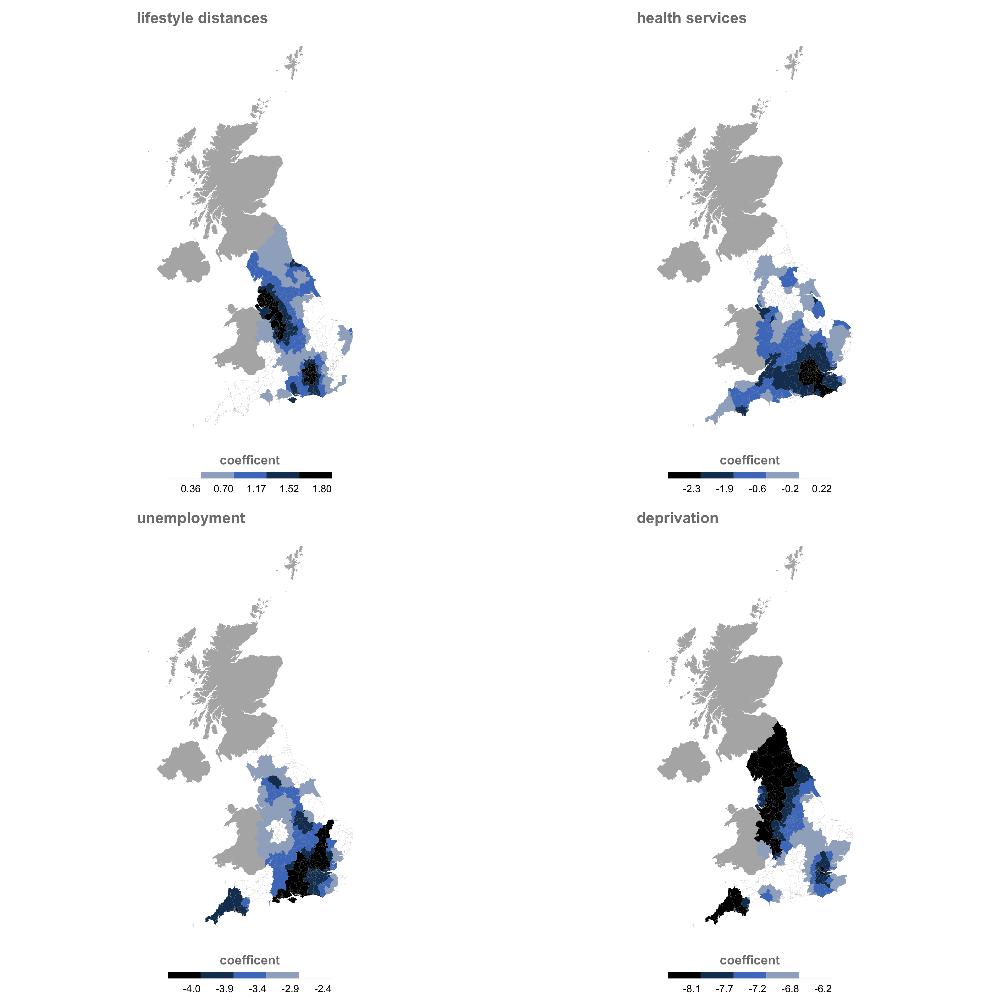

```{r setup, include = FALSE}

knitr::opts_chunk$set(echo = TRUE, warning = FALSE, 
                      message = FALSE, cache = TRUE)
```

# ageing society

## what are we doing?

Let's try *"to ensure that people can enjoy at least five extra healthy, independent years of life by 2035, whilst narrowing the gap between the experience of the richest and poorest"*. 

To do this, we could start by finding out what is the relationship between the difference between healthspan and lifespan and socio-spatial conditions. What variables associate with a life that is both *healthy* and *long*, or at the very least healthy for its duration? With a better understanding of these, we can allign policies to suit the needs of an ageing society. 

## how are we doing it?

Our data comes from the Office of National Statistics, [which collates both lifespan aand healthy lifespan](https://www.ons.gov.uk/peoplepopulationandcommunity/healthandsocialcare/healthandlifeexpectancies/datasets/healthstatelifeexpectanciesgeneralhealthforenglandbycountrydecileanduppertierlocalauthorityutlaformalesandfemalesatbirthandmenandwomenatage652010to2012) at the level of the local authority---and thus we take this geography as our unit of analysis. 

From there, we add in controls from the Consumer Data Research Centre, which compiles correlates of health in their [AHAH index](https://data.cdrc.ac.uk/). 



While the index uses dozens of colinear variables, we select a few. We augment these with median income and some demographic dynamics, also from ONS, like [income](https://www.ons.gov.uk/economy/regionalaccounts/grossdisposablehouseholdincome/datasets/regionalgrossdisposablehouseholdincomegdhibylocalauthorityintheuk).    


# foundations

## just how aged?

Over the next two decades, the poplulation of England is expected to become older. Just look.

<center>


</center>

Yet the challenge here is for healthy life and, though the relationship is strong, it is not 1:1---extra years are not healthful years. This is sad.   



As is obvious above, women live longer than men and will continue to do so according to official projections, but these additional years tend to be marked by poor health. 


The gains that women have over men are entirely explained with years of poor health, and there is a distinct geography to the healthspan-lifespan diference for both men and women, with similar clusters of differing magnitudes.

We confirm our intuitions here computing global Moran's I and then running a Monte Carlo simulation for comparison.



We can also check local Moran's I values to find specific clusters. 



There are two statistically significant clusters, one of high difference and one of low difference.



# explorations

## modelling this wicked problem

We model this using a geographically weighted regression, beginning with a bivariate regression assessing the relationship between air pollution and healthy lifespans.



We can then probe other relationships. 



# what is going on?

These maps show the relationships between various economic, environmental, and cultural factors and healthy life expectancy.

The relationship between air polution and healthy life expectancy is expectedly negative. As air polution increases, healthy life expectancy decreases. This relationship is strongest in rural areas of England, specifically regions located between London and the Midlands. 

The relationship between unhealthy lifestyles and healthy life expectancy is positive. Thus, further distances from unhealthy locations (pubs, tobacco shops, betting shops) are related increases in healthy life. This relationship is stronger around cities than in rural areas. 

The relationship between health services and healthy life expectancy is negative. Thus, further distances from health services (general practitioners, hospitals, and dentists) are related to decreases in healthy life. This relationship is strong around London.

The relationship between unemployment and healthy life expectancy is negative. High levels of unemployment are related to decreases in healthy life. 

The relationship between deprivation and healthy life expectancy is also negative. As deprivation (access to economic and socioculatural resources) increases, healthy life expectancy decreases. This relationship is strongest in northern England and other rural areas. 

# recommendations

The relationships between healthy life expectancy and related factors vary by space and factor. For each variable, differences appear to be divided by urban and rural status. For instance, access to an unhealthy lifestyle is related to lower healthy life in urban areas than rural areas. This may be due to inherently shorter distances in urban areas, in which individuals are more likely to walk to access locations. 

Whereas relationships vary by urban or rural status, not all urban and rural places exhibit the same relatioship patterns. For instance, access to health services is important in London and Liverpool but not in Leeds. Instead, deprivation factors may be more relavant in the Leeds area.

Thus, policy initiative should consider the relative importance of factors by location to take efficient action. 